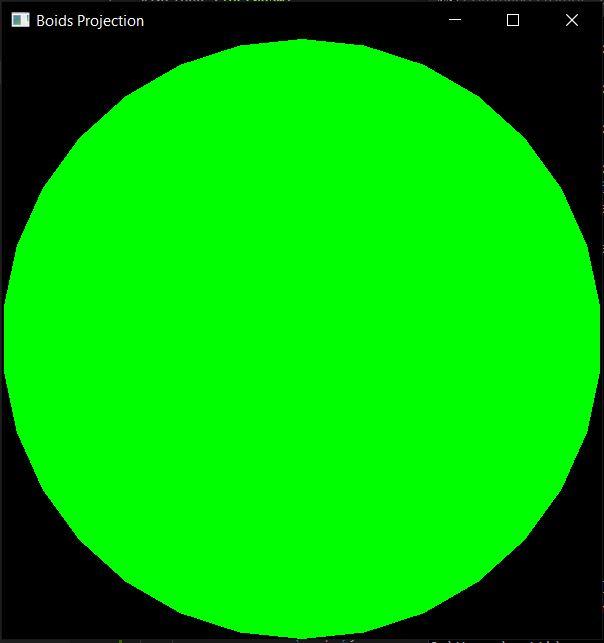
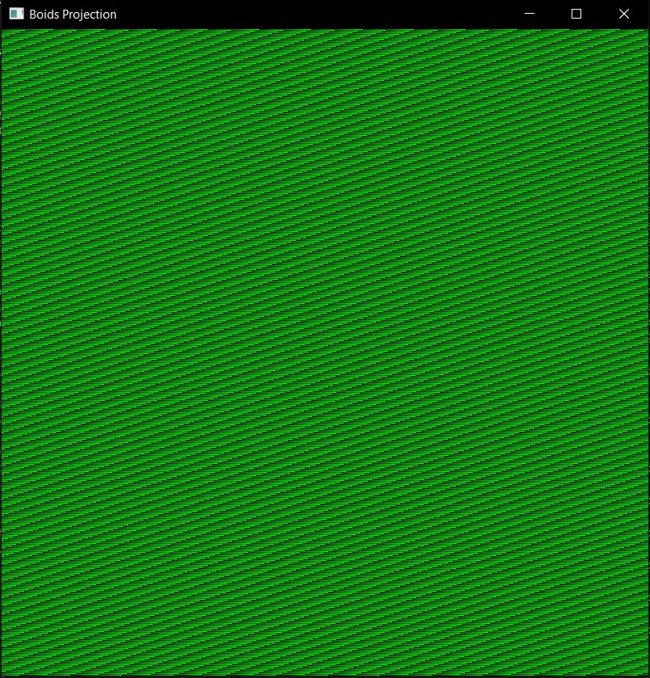

# Development of program

## 14/11/22
---
###  **Basic Program**
Create basic program to check build is working

```cpp
#include <iostream>
 
int main() {
    std::cout << "Hello, world!\n";
}
```
---
### **Shape Test**
Create a basic test program which draws a circle to the screen

```cpp
#include <iostream>
 
#include <SFML/Graphics.hpp>
 
int main()
{
    //Create a window that the program will draw to
    sf::RenderWindow window(sf::VideoMode(600, 600), "Boids Projection");
    //Limit the windows frame rate to 30
    window.setFramerateLimit(30);
 
    //Run program while window is open
    while (window.isOpen())
    {
        //Loop over all events since last loop
        sf::Event event;
        while (window.pollEvent(event))
        {
            //If close requested then close window
            if (event.type == sf::Event::Closed){
                window.close();
            }
        }
 
        //Clear window with black colour
        window.clear(sf::Color::Black);
 
        //Create a circle to draw to screen
        sf::CircleShape shape(300);
        //Set shape colour
        shape.setFillColor(sf::Color::Green);
        //Draw shape to screen
        window.draw(shape);
        //End the current frame
        window.display();
    }
}

```


-----

## **Pixel Array**

Since my program will be drawing to the screen using a pixel array I will now change the basic program to that

```cpp
#include <iostream>

#include <SFML/Graphics.hpp>


void initPixels(sf::Uint8 *arr, const int length){
    for (int i = 0; i < length; i += 4){
        arr[i] = 0;
        arr[i + 1] = i % (255 * 4);
        arr[i + 2] = 0;
        arr[i + 3] = 255;
    }
}

int main()
{
    constexpr int WIDTH = 800;
    constexpr int HEIGHT = 800;

    //Create a window that the program will draw to
    sf::RenderWindow window(sf::VideoMode(WIDTH, HEIGHT), "Boids Projection");
    //Limit the windows frame rate to 30
    window.setFramerateLimit(30);

    sf::Uint8* pixels  = new sf::Uint8[WIDTH * HEIGHT * 4];
    initPixels(pixels, WIDTH * HEIGHT * 4);

    //Run program while window is open
    while (window.isOpen())
    {
        //Loop over all events since last loop
        sf::Event event;
        while (window.pollEvent(event))
        {
            //If close requested then close window
            if (event.type == sf::Event::Closed){
                window.close();
            }
        }

        sf::Image image;
        image.create(WIDTH, HEIGHT, pixels);
        sf::Texture texture;
        texture.loadFromImage(image);
        sf::Sprite sprite(texture);
        //sprite.setTexture(texture);
        window.draw(sprite);

        //End the current frame
        window.display();
    }
}

```



---
### **FPS**
Add fps counter in order to track efficiency and make sure program runs at acceptible speeds

```cpp
//Create variable to store fps, clock to calculate fps and times to store change in time
float fps;
sf::Clock fps_clock = sf::Clock();
sf::Time previous_time = fps_clock.getElapsedTime();
sf::Time current_time;
//Load font from file and throw exeption if not found
sf::Font font;
if(!font.loadFromFile("../fonts/arial.ttf")){
    throw std::invalid_argument("FONT NOT FOUND");
}
```

```cpp
void displayFPS(sf::RenderWindow& window, const float& fps, const sf::Font& font){
    sf::Text text;
	// select the font
	text.setFont(font);
	// set the string to display
	text.setString(std::to_string(fps));
	// set the character size
	text.setCharacterSize(30);
	// set the color
	text.setFillColor(sf::Color::Red);
	//Set position
	text.setPosition(sf::Vector2f(0, 0));
	window.draw(text);
}
```
```cpp
//Calculate fps from change in time and draw to screen
current_time = fps_clock.getElapsedTime();
fps = 1.f / (current_time.asSeconds() - previous_time.asSeconds());
displayFPS(window, fps, font);
previous_time = current_time;
```

---
### **Basic Drawable**

Header file for initial drawable object
Object just draws one pixel to the screen at the x, y, coordinate

_drawable.h_
```cpp
#ifndef DRAWABLE_H
#define DRAWABLE_H

#include <SFML/Graphics.hpp>

class Drawable{

public:
    //Variables
    int x, y, z;

    //Methods
    Drawable(int x_, int y_, int z_, int r_ = 255, int g_ = 255, int b_ = 255);
    void draw(sf::Uint8 *arr, const int width);
    void setColour(int r, int g, int b);
    void setPosition(int x_, int y_, int z_);

private:
    //Variables
    int r, g, b;

    //Methods

};

#endif
```

_drawable.cpp_
```cpp
#include "../include/drawable.h"

Drawable::Drawable(int x_, int y_, int z_, int r_, int g_, int b_){
    this->x = x_;
    this->y = y_;
    this->z = z_;
    this->r = r_;
    this->g = g_;
    this->b = b_;
}

void Drawable::draw(sf::Uint8 *arr, const int width){
    int index = (this->y * width + this->x) * 4;
    arr[index] = this->r;
    arr[index + 1] = this->g;
    arr[index + 2] = this->b;
}

void Drawable::setColour(int r_, int g_, int b_){
    this->r = r_;
    this->g = g_;
    this->b = b_;
}

void Drawable::setPosition(int x_, int y_, int z_){
    this->x = x_;
    this->y = y_;
    this->z = z_;
}
```