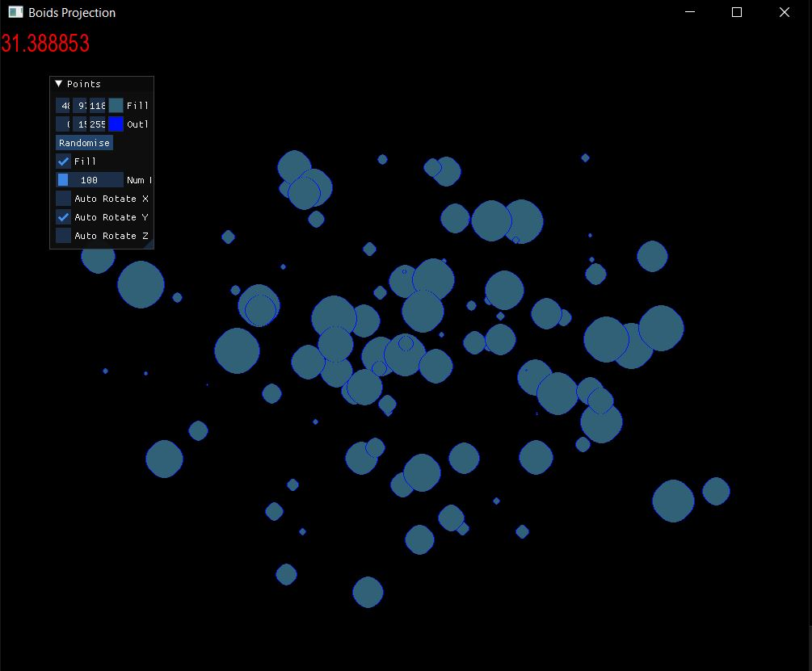

# Development of program

## 14/11/22
---
###  **Basic Program**
Create basic program to check build is working

```cpp
#include <iostream>
 
int main() {
    std::cout << "Hello, world!\n";
}
```
---
### **Shape Test**
Create a basic test program which draws a circle to the screen

```cpp
#include <iostream>
 
#include <SFML/Graphics.hpp>
 
int main()
{
    //Create a window that the program will draw to
    sf::RenderWindow window(sf::VideoMode(600, 600), "Boids Projection");
    //Limit the windows frame rate to 30
    window.setFramerateLimit(30);
 
    //Run program while window is open
    while (window.isOpen())
    {
        //Loop over all events since last loop
        sf::Event event;
        while (window.pollEvent(event))
        {
            //If close requested then close window
            if (event.type == sf::Event::Closed){
                window.close();
            }
        }
 
        //Clear window with black colour
        window.clear(sf::Color::Black);
 
        //Create a circle to draw to screen
        sf::CircleShape shape(300);
        //Set shape colour
        shape.setFillColor(sf::Color::Green);
        //Draw shape to screen
        window.draw(shape);
        //End the current frame
        window.display();
    }
}

```


-----

## **Pixel Array**

Since my program will be drawing to the screen using a pixel array I will now change the basic program to that

```cpp
#include <iostream>

#include <SFML/Graphics.hpp>


void initPixels(sf::Uint8 *arr, const int length){
    for (int i = 0; i < length; i += 4){
        arr[i] = 0;
        arr[i + 1] = i % (255 * 4);
        arr[i + 2] = 0;
        arr[i + 3] = 255;
    }
}

int main()
{
    constexpr int WIDTH = 800;
    constexpr int HEIGHT = 800;

    //Create a window that the program will draw to
    sf::RenderWindow window(sf::VideoMode(WIDTH, HEIGHT), "Boids Projection");
    //Limit the windows frame rate to 30
    window.setFramerateLimit(30);

    sf::Uint8* pixels  = new sf::Uint8[WIDTH * HEIGHT * 4];
    initPixels(pixels, WIDTH * HEIGHT * 4);

    //Run program while window is open
    while (window.isOpen())
    {
        //Loop over all events since last loop
        sf::Event event;
        while (window.pollEvent(event))
        {
            //If close requested then close window
            if (event.type == sf::Event::Closed){
                window.close();
            }
        }

        sf::Image image;
        image.create(WIDTH, HEIGHT, pixels);
        sf::Texture texture;
        texture.loadFromImage(image);
        sf::Sprite sprite(texture);
        //sprite.setTexture(texture);
        window.draw(sprite);

        //End the current frame
        window.display();
    }
}

```


---
### **FPS**
Add fps counter in order to track efficiency and make sure program runs at acceptible speeds

```cpp
//Create variable to store fps, clock to calculate fps and times to store change in time
float fps;
sf::Clock fps_clock = sf::Clock();
sf::Time previous_time = fps_clock.getElapsedTime();
sf::Time current_time;
//Load font from file and throw exeption if not found
sf::Font font;
if(!font.loadFromFile("../fonts/arial.ttf")){
    throw std::invalid_argument("FONT NOT FOUND");
}
```

```cpp
void displayFPS(sf::RenderWindow& window, const float& fps, const sf::Font& font){
    sf::Text text;
	// select the font
	text.setFont(font);
	// set the string to display
	text.setString(std::to_string(fps));
	// set the character size
	text.setCharacterSize(30);
	// set the color
	text.setFillColor(sf::Color::Red);
	//Set position
	text.setPosition(sf::Vector2f(0, 0));
	window.draw(text);
}
```
```cpp
//Calculate fps from change in time and draw to screen
current_time = fps_clock.getElapsedTime();
fps = 1.f / (current_time.asSeconds() - previous_time.asSeconds());
displayFPS(window, fps, font);
previous_time = current_time;
```


---
### **Basic Drawable**

Header file for initial drawable object
Object just draws one pixel to the screen at the x, y, coordinate

_drawable.h_
```cpp
#ifndef DRAWABLE_H
#define DRAWABLE_H

#include <SFML/Graphics.hpp>

class Drawable{

public:
    //Variables
    int x, y, z;

    //Methods
    Drawable(int x_, int y_, int z_, int r_ = 255, int g_ = 255, int b_ = 255);
    void draw(sf::Uint8 *arr, const int width);
    void setColour(int r, int g, int b);
    void setPosition(int x_, int y_, int z_);

private:
    //Variables
    int r, g, b;

    //Methods

};

#endif
```

_drawable.cpp_
```cpp
#include "../include/drawable.h"

Drawable::Drawable(int x_, int y_, int z_, int r_, int g_, int b_){
    this->x = x_;
    this->y = y_;
    this->z = z_;
    this->r = r_;
    this->g = g_;
    this->b = b_;
}

void Drawable::draw(sf::Uint8 *arr, const int width){
    int index = (this->y * width + this->x) * 4;
    arr[index] = this->r;
    arr[index + 1] = this->g;
    arr[index + 2] = this->b;
}

void Drawable::setColour(int r_, int g_, int b_){
    this->r = r_;
    this->g = g_;
    this->b = b_;
}

void Drawable::setPosition(int x_, int y_, int z_){
    this->x = x_;
    this->y = y_;
    this->z = z_;
}
```

---
## 15/11/22
---
### **ImGui Setup**
Update CMakeLists.txt to link to imgui
```cmake
cmake_minimum_required(VERSION 3.0.0)
project(BoidsProjection VERSION 0.1.0)

list(APPEND CMAKE_PREFIX_PATH "C:\\Users\\matth\\vcpkg\\installed\\x86-windows\\share\\sfml")
find_package(SFML CONFIG REQUIRED COMPONENTS graphics system window)
include_directories(${SFML_INCLUDE_DIR})

list(APPEND CMAKE_PREFIX_PATH "C:\\Users\\matth\\vcpkg\\installed\\x86-windows\\share\\imgui")
list(APPEND CMAKE_PREFIX_PATH "C:\\Users\\matth\\vcpkg\\installed\\x86-windows\\share\\ImGui-SFML")
find_package(imgui CONFIG REQUIRED)
find_package(ImGui-SFML CONFIG REQUIRED)

add_executable(BoidsProjection src/main.cpp src/drawable.cpp)

target_link_libraries(${PROJECT_NAME}
    imgui::imgui
    sfml-graphics sfml-system sfml-window
    ImGui-SFML::ImGui-SFML
)
```

Add imgui code to _main.cpp_ in correct places to initialise, create and get input from gui

```cpp
//Init imgui
ImGui::SFML::Init(window);

//Process imgui events
ImGui::SFML::ProcessEvent(event);

//Update imgui window
ImGui::SFML::Update(window, deltaClock.restart());

//Create imgui window to allow colour picking
ImGui::Begin("Colours");
ImGui::ColorEdit3("Dot", (float*)&colour);
ImGui::End();
//Set colour to the colour picked from colour picker
d.setColour(round(colour[0] * 255), round(colour[1] * 255), round(colour[2] * 255));

//Draw d at 1000 random positions
for(int i = 0; i < 1000; i++){
    int x = rand() % WIDTH;
    int y = rand() % HEIGHT;
    d.setPosition(x, y, 0);
    d.draw(pixels, WIDTH);
}

//Render imgui windows
ImGui::SFML::Render(window);
```


---
### **Create Point Class**
_point.h_
```cpp
#ifndef POINT_H
#define POINT_H

#include <iostream>
#include <SFML/Graphics.hpp>

#include "drawable.h"

class Point: public Drawable{

public:
    //Vaariables


    //Methods
    Point(int x_, int y_, int z_, int rad_, int r_ = 255, int g_ = 255, int b_ = 255);
    void draw(sf::Uint8 *arr, const int width);

private:
    //Variables
    int rad;

    //Methods


};


#endif
```

_point.cpp_
```cpp
#include "../include/point.h"

Point::Point(int x_, int y_, int z_, int rad_, int r_, int g_, int b_) : Drawable{x_, y_, z_, r_, g_, b_}{
    this->rad = rad_;
}

void Point::draw(sf::Uint8 *arr, const int width){
    for(int i = -5; i < 6; i++){
        for(int j = -5; j < 6; j++){
            int index = ((this->y + j) * width + (this->x + i));
            if(index > -1 && index < 800){
                arr[index] = this->r;
                arr[index + 1] = this->g;
                arr[index + 2] = this->b;
            }
        }
    }
}
```
The points are stuck at the very top left


Loop was too small so not all indexes were being allowed.  
Change to width*width for the for loop to allow all points on screen  
Should change to width * height to allow for window size to be defined at a single point in program and still work

```cpp
if(index > -1 && index < width*width){
    arr[index * 4] = this->r;
    arr[index * 4 + 1] = this->g;
    arr[index * 4+ 2] = this->b;
}
```


---
### **Circular Points**

Currently points are just squares with sized of 10  
The points would look much better if they were circular  
Circular points can be implemented using Bresenhams circle drawing algorithm
```cpp
//Plot all 8 points, one in each octant of the circle
void Point::plotCircle(sf::Uint8 *pixels, const int width, int x, int y){
    auto plot = [&](const int j, const int i){
        if(i < 0 || i > width || j < 0 || j > 800){return;}
        pixels[(i * width + j) * 4] = this->r;
        pixels[(i * width + j) * 4 + 1] = this->g;
        pixels[(i * width + j) * 4 + 2] = this->b;
    };
    plot(this->x + x, this->y + y);
    plot(this->x - x, this->y + y);
    plot(this->x + x, this->y - y);
    plot(this->x - x, this->y - y);
    plot(this->x - y, this->y + x);
    plot(this->x + y, this->y - x);
    plot(this->x - y, this->y - x);
    plot(this->x + y, this->y + x);
}

void Point::draw(sf::Uint8 *pixels, const int width){
    int x = 0;
    int y = this->rad;
    int decPar = 3 - 2 * this->rad;
    plotCircle(pixels, width, x, y);
    while( y >= x){
        x++;
        if(decPar > 0){
            y--;
            decPar = decPar + 4 * (x - y) + 10;
        }else{
            decPar = decPar + 4 * x + 6;
        }
        plotCircle(pixels, width, x, y);
    }
}
```


---
### **Fill Points**

To fill thr points we can draw lines across thw circle every time we calculate new x and y values for the edge of the circle


```cpp
auto plotLine = [&](const int x1, const int x2, const int y){
    int px1 = x1, px2 = x2;
    if(px1 > px2){ px1 = x2; px2 = x1; }
    for(int c = px1; c < px2; c++){
        plot(c, y);
    }
};

if(this->fill){
    plotLine(this->x - y, this->x + y, this->y + x);
    plotLine(this->x - x, this->x + x, this->y + y);
    plotLine(this->x - x, this->x + x, this->y - y);
    plotLine(this->x - y, this->x + y, this->y - y);
}
```

This code produces incorrect filling of the points, the top half of the circle is drawn upwards rather than down to fill the circle


The incorrect line of code was drawing the line at this->y - y, since y was negative this meant the code was drawing above the centre position  
The correct code subtracts x from the y position to fill the correct rows of the circle
```cpp
//plotLine(this->x - y, this->x + y, this->y - y);
plotLine(this->x - y, this->x + y, this->y - x);
```
The lines are drawn to fill according to this diagram of how bresenhams circle algorithm draws a circle  
Lines connect all points on the same y value  


The correct code produces circles which have all been filled


---
### **Randomise and Fill**
Added the ability to randomise the positions of all test points as well as toggle fill to imgui window
```cpp
if(ImGui::Button("Randomise")){
    for(auto& p : points){
        int x = rand() % WIDTH;
        int y = rand() % HEIGHT;
        p.setPosition(x, y, 0);
    }
}
ImGui::Checkbox("Fill", &fill);
```


---
## 17/11/22
### **Change Point Fill Colour**

Currently all points have the same fill colour and outline colour, this makes them difficult to differentiate when they are stacked over eachother which can be solved by adding an outline to them  
Adding an outline is the same as changing the colour of the points that are plotted in the lines which are being drawn across the circles to fill them

```cpp
auto plot = [&](const int j, const int i, bool outline = false){
    if(i < 0 || i > width || j < 0 || j > height){return;}
    int r, g, b;
    if(!outline){ r = this->outr; g = this->outg; b = this->outb; }
    else{ r = this->r; g = this->g; b = this->b; }
    pixels[(i * width + j) * 4] = r;
    pixels[(i * width + j) * 4 + 1] = g;
    pixels[(i * width + j) * 4 + 2] = b;
};
```


Currently the lines are being drawn from the leftmost x value to one before the rightmost which is causing the left hand side not to be drawn  
```cpp
auto plotLine = [&](const int x1, const int x2, const int y){
    int px1 = x1, px2 = x2;
    if(px1 > px2){ px1 = x2; px2 = x1; }
    for(int c = px1; c < px2; c++){
        plot(c, y, true);
    }
};
```

Changing the starting of the loop to int c = px1 + 1 fixes the issue  

```cpp
auto plotLine = [&](const int x1, const int x2, const int y){
    int px1 = x1, px2 = x2;
    if(px1 > px2){ px1 = x2; px2 = x1; }
    for(int c = px1 + 1; c < px2; c++){
        plot(c, y, true);
    }
};
```


This solution is not the best solution as it leaves the top and botton of the circle quite bare and also doesn't allow for variable outline width.  This solution works for now and can easily be changed at a later point if that becomes a necessity.

### **Fixing Window Size Crash**
When the window size is changed in the source code the program crashes if the width gets bigger than 800 and if it is less than 800, the points are only drawn in a width x width square on the window


Runing the program under the debugger yields this error in the _point.cpp_ file.  
The error means I am trying to access memory which hasn't been allocated for this array and so the index (i * width + j) * 4 is greater than then length of the array or is negative


By logging the relevant variable I can work out the values when the program crashes  
>i: 812 j: 193 index: 3248772 length: 3200000

The error is with the equation for calculating the index of the point in the array. The correct equation for the index if (j * width + i) * 4 whereas I have mistyped (i * width + j) * 4.

After this fix the program still crashed when running. Continuing to log the output I discovered that the program attempts to access outside of the pixel array multiple times.

>i: 492 j: 800 index: 3201968 length: 3200000 width: 1000 height: 800  
i: 484 j: 800 index: 3201936 length: 3200000 width: 1000 height: 800  
i: 493 j: 800 index: 3201972 length: 3200000 width: 1000 height: 800  
i: 483 j: 800 index: 3201932 length: 3200000 width: 1000 height: 800  
i: 740 j: 800 index: 3202960 length: 3200000 width: 1000 height: 800  
i: 720 j: 800 index: 3202880 length: 3200000 width: 1000 height: 800  
i: 741 j: 800 index: 3202964 length: 3200000 width: 1000 height: 800  
i: 719 j: 800 index: 3202876 length: 3200000 width: 1000 height: 800  
i: 96 j: 800 index: 3200384 length: 3200000 width: 1000 height: 800  
i: 72 j: 800 index: 3200288 length: 3200000 width: 1000 height: 800  
i: 104 j: 800 index: 3200416 length: 3200000 width: 1000 height: 800  
i: 92 j: 800 index: 3200368 length: 3200000 width: 1000 height: 800  
i: 104 j: 800 index: 3200416 length: 3200000 width: 1000 height: 800  
i: 92 j: 800 index: 3200368 length: 3200000 width: 1000 height: 800  
i: 760 j: 800 index: 3203040 length: 3200000 width: 1000 height: 800  

This always happend when j = 800 which should never happen. The reason it is happening is because my check for whether a coordinate is valid is incorrect and allowing invalid coordinates to get through. 

The original line of code was:
```cpp
if(i < 0 || i > width || j < 0 || j > height){return;}
```
Whereas the correct line should be
```cpp
if(i < 0 || i >= width || j < 0 || j >= height){return;}
```
The reason for this is because width and height are the numbers of rows and columns however, the indexes for accessing the array start at zero, this means that a coordinate such as (width, height) is invalid and the bottom right coordinate is actually (width - 1, height -1)

After this fix the program runs but is still not drawing over the whole screen.


---
## 18/11/22
### **Fixing Not Drawing To Whole Screen**

Start by filling points with a single point which is meant to be drawn where points are currently not being drawn

```cpp
constexpr int WIDTH = 600;
constexpr int HEIGHT = 800;

std::vector<Point> points = {Point(500, 600, 0, 100)};
```

With the above window size and point coordinates the point is drawn here


With the same window size but a differenc coordinate position the circle is drawn here


Here what should be the y coordinate has decreased but the x potition on screen has changed

The problem is with my plot function parameters. The parameters are in toe order j(y), i(x) but when called the function is given them in order x(i), y(j)

```cpp 
auto plot = [&](const int j, const int i, bool outline = false){
```

This is easily fixed by switching the order of the parameters to

```cpp
auto plot = [&](const int i, const int j, bool outline = false)
```

Now the whole screen is covered by points when they are plotted in random positions


---
### **Variable Number Of Points**

Adding a slider to allow the number of points being drawn for the user allows me to test the programs efficiency.  
Running in a debug build, the program is pretty smooth with a couple thousand points however, increasing the number up to 10000 does cause the fps to drop by quite a lot.


Running the program in a Release build produces much better performance as it is much more optimised. This means that at 10000 points being drawn, the program runs perfectly fine.


It is not until 100,000 points being drawn that the Release build drops to similar levels to debug mode at 10,000 points


## **Implementing Rotation**

First I need 3 variables to store the angles of rotation of the camera as well as a map to store the values of the trig functions since they do not need to be calculated for every object, just when the camera moves.  
The values in the map have to be initialised since the _.at()_ function used in the set trig values does not allow initialisation and will throw an error if attempting to ccess an invalid position. This is better than using the _[ ]_ accessor since this can create new records in the map which could lead to errors doing arithmetic on empty map values.

```cpp
//Floats to store the rotation angle of the cameras
float tx = 0, ty = 0, tz = 0;
//Map to store values for trig finctions
std::map<std::string, float> trigFunctions = {{"sx", sin(degToRad(tx))},
                                                {"sy", sin(degToRad(ty))},
                                                {"sz", sin(degToRad(tz))},
                                                {"cx", cos(degToRad(tx))},
                                                {"cy", cos(degToRad(ty))},
                                                {"cz", cos(degToRad(tz))}};
```

Functions to convert between degrees and radians, and to calculate the values of the trig function

```cpp
template <typename T>
auto degToRad(T angle){
        return float(angle) * PI / 180.f;
}

template <typename T, typename U>
void setTrigValues(const T tx, const T ty, const T tz, U tfunct){
    tfunct.at("sx") = sin(degToRad(tx));
    tfunct.at("sy") = sin(degToRad(ty));
    tfunct.at("sz") = sin(degToRad(tz));

    tfunct.at("cx") = cos(degToRad(tx));
    tfunct.at("cy") = cos(degToRad(ty));
    tfunct.at("cz") = cos(degToRad(tz));
}
```

Then I need to implement keyboard input to allow for the camera to be rotated.

```cpp
if (event.type == sf::Event::Closed){
    window.close();
}else if (event.type == sf::Event::KeyPressed) {
    switch(event.key.code) {
        case(sf::Keyboard::Down): {
            tx += 1;
        }
        break;
        case(sf::Keyboard::Up): {
            tx -= 1;
        }
        break;
        case(sf::Keyboard::Left): {
            ty += 1;
        }
        break;
        case(sf::Keyboard::Right): {
            ty -= 1;
        }
        break;
        case(sf::Keyboard::Comma):{
            tz += 1;
        }
        break;
        case(sf::Keyboard::Period):{
            tz -= 1;
        }
        break;
        case(sf::Keyboard::Space): {
            tx = 26;
            ty = 40;
            tz = 0;
        }
        break;
        default:{
            std::cout<<"Key Code Pressed: "<<event.key.code<<'\n';
        }
        break;
    }
}
```

All rotations are multiplied out to produce a single calculation that can be completed for each component of the coordinate


```cpp
template<typename T, typename U>
void Drawable::rotX(T tx, T ty, T tz, U trigfunct){
    //x * cosy * cosz - y * cosy * sinz + z * siny
    this->px = this->x * trigfunct.at("cy") * trigfunct.at("cz") + this->y * trigfunct.at("cy")* trigfunct.at("sz") + this->z * trigfunct.at("sy");
}

template<typename T, typename U>
void Drawable::rotY(T tx, T ty, T tz, U trigfunct){
    //x * (sinx * siny * cosx + cosx * sinz) - y * (sinx * siny * sinz - cosx * cosz) - z * sinx * cosy
    this->py = this->x * (trigfunct.at("sx") * trigfunct.at("sy") * trigfunct.at("cx") + trigfunct.at("cx") * trigfunct.at("sx")) + this->y * (trigfunct.at("sx") * trigfunct.at("sy") * trigfunct.at("sz") - trigfunct.at("cx") * trigfunct.at("cz")) - this->z * trigfunct.at("sx") * trigfunct.at("cy");
}

template<typename T, typename U>
void Drawable::rotZ(T tx, T ty, T tz, U trigfunct){
    //x * (sinx * siny - cosx * cosz * siny) + y * (cosx * siny * sinz + sinx * cosz) + z * cosx * cosy
    this->pz = this->x * (trigfunct.at("sx") * trigfunct.at("sy") - trigfunct.at("cx") * trigfunct.at("cz") * trigfunct.at("sy")) + this->y * (trigfunct.at("cx") * trigfunct.at("sy") * trigfunct.at("sz") + trigfunct.at("sx") * trigfunct.at("cx")) + this->z * trigfunct.at("cx") * trigfunct.at("cy");
}

template<typename T, typename U>
void Drawable::rotAll(T tx, T ty, T tz, U trigfunct){
    this->rotX(tx, ty, tz, trigfunct);
    this->rotY(tx, ty, tz, trigfunct);
    this->rotZ(tx, ty, tz, trigfunct);
}
```

The sign in front of rotx and roty is + instead of - since when drawing to the screen, up is negative and down is positive.

---
## 20/11/22
### **Rotate Points**

Call rotAll function at start of draw function and alter draw function to draw at this->px and this->py rather than this->x and this->y referring to projected x and projected y  
This results in the points being able to be rotated about a point


These rotated points are hard to follow if the rotations are correct so I will draw 4 points, an origin and a point along each axis to check rotations


Currently all points are being drawn from the top left however, I want the center of the screen to be the origin. This means I have to add an offset to the draw function of half the width and half the height.


Implementing the offset moves the points to the center of the screen however, the check to make sure nothing is being drawn offscreen and therefore out of the range of the array only works for drawing from top left.


The current check for within bounds is:
```cpp
if(i < 0 || i >= width || j < 0 || j >= height){return;}
```

The correct check should be:
```cpp
if(i < -this->offsetx || i >= this->offsetx || j < -this->offsety || j >= this->offsety){return;}
```

Points are being rotated however the x axis rotation appears incorrect.  
On the drawn diagram below, all points should be being rotated about the x axis, blue line, which means all points along the blue line should not move, the point drawn along the x axis however is being moved which means there is a problem.


To check whether this is the only problem I can implement unit tests to test the rotation code.

---
#### **Unit Tests Addition**

_testRotate.cpp_

```cpp
#include <iostream>
#include <vector>
#include <map>
#include <tuple>
#include <gtest/gtest.h>

#include "../include/drawable.h"
#include "../include/point.h"

#define PI 3.14159

TEST(TrueTest, AlwaysTrue){
    EXPECT_EQ(1, 1);
}

TEST(Rotate, RotateX0){
    float tx = 0, ty = 0, tz = 0;
    auto degToRad = [](float angle){
            return float(angle) * PI / 180.f;
    };
    std::map<std::string, float> trigFunctions = {{"sx", sin(degToRad(tx))},
                                                    {"sy", sin(degToRad(ty))},
                                                    {"sz", sin(degToRad(tz))},
                                                    {"cx", cos(degToRad(tx))},
                                                    {"cy", cos(degToRad(ty))},
                                                    {"cz", cos(degToRad(tz))}};
    Point p(100, 0, 0, 0, 0);
    p.rotAll(tx, ty, tz, trigFunctions);
    std::tuple<int, int, int> exp = {100,0,0};
    EXPECT_EQ(exp, p.getPXYZ());
}

TEST(Rotate, RotateX90){
    float tx = 90, ty = 0, tz = 0;
    auto degToRad = [](float angle){
            return float(angle) * PI / 180.f;
    };
    std::map<std::string, float> trigFunctions = {{"sx", sin(degToRad(tx))},
                                                    {"sy", sin(degToRad(ty))},
                                                    {"sz", sin(degToRad(tz))},
                                                    {"cx", cos(degToRad(tx))},
                                                    {"cy", cos(degToRad(ty))},
                                                    {"cz", cos(degToRad(tz))}};
    Point p(100, 0, 0, 0, 0);
    p.rotAll(tx, ty, tz, trigFunctions);
    std::tuple<int, int, int> exp = {100,0,0};
    EXPECT_EQ(exp, p.getPXYZ());
}

TEST(Rotate, RotateX180){
    float tx = 180, ty = 0, tz = 0;
    auto degToRad = [](float angle){
            return float(angle) * PI / 180.f;
    };
    std::map<std::string, float> trigFunctions = {{"sx", sin(degToRad(tx))},
                                                    {"sy", sin(degToRad(ty))},
                                                    {"sz", sin(degToRad(tz))},
                                                    {"cx", cos(degToRad(tx))},
                                                    {"cy", cos(degToRad(ty))},
                                                    {"cz", cos(degToRad(tz))}};
    Point p(100, 0, 0, 0, 0);
    p.rotAll(tx, ty, tz, trigFunctions);
    std::tuple<int, int, int> exp = {100,0,0};
    EXPECT_EQ(exp, p.getPXYZ());
}

TEST(Rotate, RotateX360){
    float tx = 360, ty = 0, tz = 0;
    auto degToRad = [](float angle){
            return float(angle) * PI / 180.f;
    };
    std::map<std::string, float> trigFunctions = {{"sx", sin(degToRad(tx))},
                                                    {"sy", sin(degToRad(ty))},
                                                    {"sz", sin(degToRad(tz))},
                                                    {"cx", cos(degToRad(tx))},
                                                    {"cy", cos(degToRad(ty))},
                                                    {"cz", cos(degToRad(tz))}};
    Point p(100, 0, 0, 0, 0);
    p.rotAll(tx, ty, tz, trigFunctions);
    std::tuple<int, int, int> exp = {100,0,0};
    EXPECT_EQ(exp, p.getPXYZ());
}

TEST(Rotate, RotateX45){
    float tx = 45, ty = 0, tz = 0;
    auto degToRad = [](float angle){
            return float(angle) * PI / 180.f;
    };
    std::map<std::string, float> trigFunctions = {{"sx", sin(degToRad(tx))},
                                                    {"sy", sin(degToRad(ty))},
                                                    {"sz", sin(degToRad(tz))},
                                                    {"cx", cos(degToRad(tx))},
                                                    {"cy", cos(degToRad(ty))},
                                                    {"cz", cos(degToRad(tz))}};
    Point p(100, 0, 0, 0, 0);
    p.rotAll(tx, ty, tz, trigFunctions);
    std::tuple<int, int, int> exp = {100,0,0};
    EXPECT_EQ(exp, p.getPXYZ());
}

TEST(Rotate, RotateY0){
    float tx = 0, ty = 0, tz = 0;
    auto degToRad = [](float angle){
            return float(angle) * PI / 180.f;
    };
    std::map<std::string, float> trigFunctions = {{"sx", sin(degToRad(tx))},
                                                    {"sy", sin(degToRad(ty))},
                                                    {"sz", sin(degToRad(tz))},
                                                    {"cx", cos(degToRad(tx))},
                                                    {"cy", cos(degToRad(ty))},
                                                    {"cz", cos(degToRad(tz))}};
    Point p(0, 100, 0, 0, 0);
    p.rotAll(tx, ty, tz, trigFunctions);
    std::tuple<int, int, int> exp = {0,-100,0};
    EXPECT_EQ(exp, p.getPXYZ());
}

TEST(Rotate, RotateY90){
    float tx = 0, ty = 90, tz = 0;
    auto degToRad = [](float angle){
            return float(angle) * PI / 180.f;
    };
    std::map<std::string, float> trigFunctions = {{"sx", sin(degToRad(tx))},
                                                    {"sy", sin(degToRad(ty))},
                                                    {"sz", sin(degToRad(tz))},
                                                    {"cx", cos(degToRad(tx))},
                                                    {"cy", cos(degToRad(ty))},
                                                    {"cz", cos(degToRad(tz))}};
    Point p(0, 100, 0, 0, 0);
    p.rotAll(tx, ty, tz, trigFunctions);
    std::tuple<int, int, int> exp = {0,-100,0};
    EXPECT_EQ(exp, p.getPXYZ());
}

TEST(Rotate, RotateY180){
    float tx = 0, ty = 180, tz = 0;
    auto degToRad = [](float angle){
            return float(angle) * PI / 180.f;
    };
    std::map<std::string, float> trigFunctions = {{"sx", sin(degToRad(tx))},
                                                    {"sy", sin(degToRad(ty))},
                                                    {"sz", sin(degToRad(tz))},
                                                    {"cx", cos(degToRad(tx))},
                                                    {"cy", cos(degToRad(ty))},
                                                    {"cz", cos(degToRad(tz))}};
    Point p(0, 100, 0, 0, 0);
    p.rotAll(tx, ty, tz, trigFunctions);
    std::tuple<int, int, int> exp = {0,-100,0};
    EXPECT_EQ(exp, p.getPXYZ());
}

TEST(Rotate, RotateY360){
    float tx = 0, ty = 360, tz = 0;
    auto degToRad = [](float angle){
            return float(angle) * PI / 180.f;
    };
    std::map<std::string, float> trigFunctions = {{"sx", sin(degToRad(tx))},
                                                    {"sy", sin(degToRad(ty))},
                                                    {"sz", sin(degToRad(tz))},
                                                    {"cx", cos(degToRad(tx))},
                                                    {"cy", cos(degToRad(ty))},
                                                    {"cz", cos(degToRad(tz))}};
    Point p(0, 100, 0, 0, 0);
    p.rotAll(tx, ty, tz, trigFunctions);
    std::tuple<int, int, int> exp = {0,-100,0};
    EXPECT_EQ(exp, p.getPXYZ());
}

TEST(Rotate, RotateY45){
    float tx = 0, ty = 45, tz = 0;
    auto degToRad = [](float angle){
            return float(angle) * PI / 180.f;
    };
    std::map<std::string, float> trigFunctions = {{"sx", sin(degToRad(tx))},
                                                    {"sy", sin(degToRad(ty))},
                                                    {"sz", sin(degToRad(tz))},
                                                    {"cx", cos(degToRad(tx))},
                                                    {"cy", cos(degToRad(ty))},
                                                    {"cz", cos(degToRad(tz))}};
    Point p(0, 100, 0, 0, 0);
    p.rotAll(tx, ty, tz, trigFunctions);
    std::tuple<int, int, int> exp = {0,-100,0};
    EXPECT_EQ(exp, p.getPXYZ());
}

TEST(Rotate, RotateZ0){
    float tx = 0, ty = 0, tz = 0;
    auto degToRad = [](float angle){
            return float(angle) * PI / 180.f;
    };
    std::map<std::string, float> trigFunctions = {{"sx", sin(degToRad(tx))},
                                                    {"sy", sin(degToRad(ty))},
                                                    {"sz", sin(degToRad(tz))},
                                                    {"cx", cos(degToRad(tx))},
                                                    {"cy", cos(degToRad(ty))},
                                                    {"cz", cos(degToRad(tz))}};
    Point p(0, 0, 100, 0, 0);
    p.rotAll(tx, ty, tz, trigFunctions);
    std::tuple<int, int, int> exp = {0,0,100};
    EXPECT_EQ(exp, p.getPXYZ());
}

TEST(Rotate, RotateZ90){
    float tx = 0, ty = 0, tz = 90;
    auto degToRad = [](float angle){
            return float(angle) * PI / 180.f;
    };
    std::map<std::string, float> trigFunctions = {{"sx", sin(degToRad(tx))},
                                                    {"sy", sin(degToRad(ty))},
                                                    {"sz", sin(degToRad(tz))},
                                                    {"cx", cos(degToRad(tx))},
                                                    {"cy", cos(degToRad(ty))},
                                                    {"cz", cos(degToRad(tz))}};
    Point p(0, 0, 100, 0, 0);
    p.rotAll(tx, ty, tz, trigFunctions);
    std::tuple<int, int, int> exp = {0,0,100};
    EXPECT_EQ(exp, p.getPXYZ());
}

TEST(Rotate, RotateZ180){
    float tx = 0, ty = 0, tz = 180;
    auto degToRad = [](float angle){
            return float(angle) * PI / 180.f;
    };
    std::map<std::string, float> trigFunctions = {{"sx", sin(degToRad(tx))},
                                                    {"sy", sin(degToRad(ty))},
                                                    {"sz", sin(degToRad(tz))},
                                                    {"cx", cos(degToRad(tx))},
                                                    {"cy", cos(degToRad(ty))},
                                                    {"cz", cos(degToRad(tz))}};
    Point p(0, 0, 100, 0, 0);
    p.rotAll(tx, ty, tz, trigFunctions);
    std::tuple<int, int, int> exp = {0,0,100};
    EXPECT_EQ(exp, p.getPXYZ());
}

TEST(Rotate, RotateZ360){
    float tx = 0, ty = 0, tz = 360;
    auto degToRad = [](float angle){
            return float(angle) * PI / 180.f;
    };
    std::map<std::string, float> trigFunctions = {{"sx", sin(degToRad(tx))},
                                                    {"sy", sin(degToRad(ty))},
                                                    {"sz", sin(degToRad(tz))},
                                                    {"cx", cos(degToRad(tx))},
                                                    {"cy", cos(degToRad(ty))},
                                                    {"cz", cos(degToRad(tz))}};
    Point p(0, 0, 100, 0, 0);
    p.rotAll(tx, ty, tz, trigFunctions);
    std::tuple<int, int, int> exp = {0,0,100};
    EXPECT_EQ(exp, p.getPXYZ());
}

TEST(Rotate, RotateZ45){
    float tx = 0, ty = 0, tz = 45;
    auto degToRad = [](float angle){
            return float(angle) * PI / 180.f;
    };
    std::map<std::string, float> trigFunctions = {{"sx", sin(degToRad(tx))},
                                                    {"sy", sin(degToRad(ty))},
                                                    {"sz", sin(degToRad(tz))},
                                                    {"cx", cos(degToRad(tx))},
                                                    {"cy", cos(degToRad(ty))},
                                                    {"cz", cos(degToRad(tz))}};
    Point p(0, 0, 100, 0, 0);
    p.rotAll(tx, ty, tz, trigFunctions);
    std::tuple<int, int, int> exp = {0,0,100};
    EXPECT_EQ(exp, p.getPXYZ());
}
```

Running the above test program produces the following output.


This means the values for rotation about the x axis are correct for the angles 0, 90, 180 and 360 but is incorrect for 45 degrees.  
The Y value of this rotation is incorrect meaning the function roty is incorrect.  
Current roty function:

```cpp
this->py = this->x * (trigfunct.at("sx") * trigfunct.at("sy") * trigfunct.at("cx") + trigfunct.at("cx") * trigfunct.at("sx")) + this->y * (trigfunct.at("sx") * trigfunct.at("sy") * trigfunct.at("sz") - trigfunct.at("cx") * trigfunct.at("cz")) - this->z * trigfunct.at("sx") * trigfunct.at("cy");
```

The correct code is:

```cpp
this->py = this->x * (trigfunct.at("sx") * trigfunct.at("sy") * trigfunct.at("cx") + trigfunct.at("cx") * trigfunct.at("sz")) + this->y * (trigfunct.at("sx") * trigfunct.at("sy") * trigfunct.at("sz") - trigfunct.at("cx") * trigfunct.at("cz")) - this->z * trigfunct.at("sx") * trigfunct.at("cy");
```

Th error was in the set of trig functions being multiplied by this->x.  
The added on value was _trigfunct.at("cx") * trigfunct.at("sx")_ and it should have been _trigfunct.at("cx") * trigfunct.at("sz")_.

After this change, the rotation tests all pass.


---

### **Rotating Points Cube**

After implementing all of the rotation code and generating random points, I can create a cube of random points which rotated about on screen.


After implementing the rotation code, the fill no longer works.


---
## 21/11/22
### **Fixing Fill**

The current fill code looks like this.

```cpp
if(this->fill){
    plotLine(this->px - y, this->x + y, this->py + x);
    plotLine(this->px - x, this->x + x, this->py + y);
    plotLine(this->px - x, this->x + x, this->py - y);
    plotLine(this->px - y, this->x + y, this->py - x);
}
```

When editing the code to fill fron the projected values i mussed the middle values which are the right hand side x values.

Editing the code to this fixes the issue:

```cpp
if(this->fill){
    plotLine(this->px - y, this->px + y, this->py + x);
    plotLine(this->px - x, this->px + x, this->py + y);
    plotLine(this->px - x, this->px + x, this->py - y);
    plotLine(this->px - y, this->px + y, this->py - x);
}
```




---
## 22/11/22
### **Sort By Z Value**

Currently the points are being drawn in the order that they were added to the vector. This means that quite often the points that should be hidden are being shown on top of points that are closer to the camera.  
This can be solved by sorting the vector based on the projected z value so that the points that are furthest back are drawn first.  

```cpp
std::sort(points.begin(), points.end(), [&](Point a, Point b){ return a.pz<b.pz; });
for(auto& p : points){
    p.draw(pixels, WIDTH, HEIGHT, tx, ty, tz, trigFunctions);
}
```

Simplifying to axis points and points along the x axis this produces this.


Readding back the random points produces this:


---
### **Adding Lines**

Lines will consist of two points and be connected using bresenhams line drawing algorithm.

_line.cpp_
```cpp

template <typename T>
int iPart(T x){
    return floor(x);
}

template <typename T>
int roundN(T x){
    return iPart(x + 0.5);
}

template <typename T>
float fPart(T x){
    return x - floor(x);
}

template <typename T>
float rfPart(T x){
    return 1 - fPart(x);
}

//Performs Xiaolin Wu's Line drawing algorithm to draw an anti-aliased line between the two points in line
void Line::drawLine(sf::Uint8 *pixels, const int width, const int height){
    //Lambda function to plot a single point at position (xval, yval) on screen
    auto plot = [&](int xval, int yval, float bright){
        if(xval < -this->offsetx || xval >= this->offsetx || yval < -this->offsety || yval >= this->offsety){return;}
        int index = ((yval + this->offsety) * width + (xval + this->offsetx)) * 4;
        pixels[index] = this->r;
        pixels[index + 1] = this->g;
        pixels[index + 2] = this->b;
        pixels[index + 3] = 255 * bright;
    };
    
    int LENGTH = width * height * 4;
    
    bool steep = std::abs(this->p2.py - this->p1.py) > std::abs(this->p2.px - this->p1.px);

    if(steep){
        int t = this->p1.px;
        this->p1.px = this->p1.py;
        this->p1.py = t;

        t = this->p2.px;
        this->p2.px = this->p2.py;
        this->p2.py = t;
    }

    if(this->p1.px > this->p2.px){
        int t = this->p1.px;
        this->p1.px = this->p2.px;
        this->p2.px = t;

        t = this->p1.py;
        this->p1.py = this->p2.py;
        this->p2.py = t;
    }

    float dx = this->p2.px - this->p1.px;
    float dy = this->p2.py - this->p1.py;

    float gradient = 0;

    if (dx == 0){
        gradient = 1;
    } else{
        gradient = dy/dx;
    }

    float xend = roundN(this->p1.px);
    float yend = this->p1.py + gradient * (xend - this->p1.px);
    float xgap = rfPart(static_cast<float>(this->p1.px) + 0.5);
    float xpxl1 = xend;
    float ypxl1 = iPart(yend);

    if (steep){
        plot(ypxl1, xpxl1, rfPart(yend) * xgap);
        plot(ypxl1 + 1, xpxl1, fPart(yend) * xgap);
    } else{
        plot(xpxl1, ypxl1, rfPart(yend) * xgap);
        plot(xpxl1, ypxl1 + 1, fPart(yend) * xgap);
    }
    float intery = yend + gradient;

    xend = roundN(this->p2.px);
    yend = this->p2.py + gradient * (xend - this->p2.px);
    xgap = fPart(this->p2.px + 0.5);
    float xpxl2 = xend;
    float ypxl2 = iPart(yend);
    if(steep){
        plot(ypxl2, xpxl2, rfPart(yend) * xgap);
        plot(ypxl2 + 1, xpxl2, fPart(yend) * xgap);
    }else{
        plot(xpxl2, ypxl2, rfPart(yend) + xgap);
        plot(xpxl2, ypxl2 + 1, fPart(yend) * xgap);
    }

    if(steep){
        for (int x = xpxl1 + 1; x < xpxl2; x++){
            plot(iPart(intery), x, rfPart(intery));
            plot(iPart(intery) + 1, x, fPart(intery));
            intery += gradient;
        }
    }else{
        for(int x = xpxl1 + 1; x < xpxl2; x++){
            plot(x, iPart(intery), rfPart(intery));
            plot(x, iPart(intery) + 1, fPart(intery));
            intery += gradient;
        }
    }

}


void Line::draw(sf::Uint8 *pixels, const int width, const int height, float tx, float ty, float tz, std::map<std::string, float> trigfunct){
    //Rotate points at each end of the line
    this->p1.rotAll(tx, ty, tz, trigfunct);
    this->p2.rotAll(tx, ty, tz, trigfunct);

    //Draw line connecting two points using projected x and y
    drawLine(pixels, width, height);

    //If boolean is true then draws points at each end of line using point draw function
    if(this->drawPoints){
        this->p1.rotAll(tx, ty, tz, trigfunct);
        this->p2.rotAll(tx, ty, tz, trigfunct);
        this->p1.draw(pixels, width, height, tx, ty, tz, trigfunct);
        this->p2.draw(pixels, width, height, tx, ty, tz, trigfunct);
    }
}

```


---
### **Restructure into Library**

Restructuring the build into a library which can be linked to the main executable and the test executable makes moving the code between projects as well as adding to it much simpler as it is only changed in one place.

The new CMakeLists are:

_CMakeLists.txt_
```cpp
cmake_minimum_required(VERSION 3.22.0)
project(BoidsProjection VERSION 0.1.0)

find_package(SFML CONFIG REQUIRED COMPONENTS graphics system window)
include_directories(src)
find_package(imgui CONFIG REQUIRED)
find_package(ImGui-SFML CONFIG REQUIRED)

add_subdirectory(src)
add_subdirectory(tests)
```

_src/CMakeLists.txt_
```cpp
cmake_minimum_required(VERSION 3.22.0)

add_library(drawables drawable.cpp point.cpp line.cpp)

find_path(SFML_INCLUDES SFML/Graphics.hpp)
target_include_directories(drawables PUBLIC drawable.h point.h line.h ${SFML_INCLUDES})

add_executable(${PROJECT_NAME} main.cpp)

target_link_libraries(${PROJECT_NAME}
    imgui::imgui
    sfml-graphics sfml-system sfml-window
    ImGui-SFML::ImGui-SFML
    drawables
)
```

_tests/CMakeLists.txt_
```cpp
cmake_minimum_required(VERSION 3.22.0)

find_package(GTest)
include_directories(${GTEST_INCLUDE_DIRS})

add_executable(test testRotate.cpp)

target_link_libraries(test
    GTest::GTest 
    GTest::Main
    drawables
)
```

---
## 24/11/22
### **Switch To Using std::variant to Store Drawables**
Using a std::variant to store all of the drawable items makes drawing them all to the screen much simpler as well as makes sorting the objects so they overlap correctly much easier.


Since the definition of the vsctor of variants is long and will change as I develop the program I can define a type which acts the same as the vector which I can use throughout the program. Doing this means when I add more drawable objects, I only have to change the definitions once.
```cpp
using DrawVariantVector = std::vector<std::variant<Drawable, Point, Line>>;
```

To draw the objects to the screen I first sort the vector and then call the specific functions for each object. In the future these could be moved to inside the objects so I do not have to check types.

```cpp
std::ranges::sort(drawObjects, std::greater(), [](auto const& x){
    return std::visit([](auto const& e){ return e.sortVal; }, x);
});

int pointCount = 0;

for(auto& obj : drawObjects){
    if(std::holds_alternative<Point>(obj)){
        pointCount++;
        std::get<Point>(obj).setColour(round(pointFillColour[0] * 255), round(pointFillColour[1] * 255), round(pointFillColour[2] * 255));
        std::get<Point>(obj).setOutlineColour(round(pointOutlineColour[0] * 255), round(pointOutlineColour[1] * 255), round(pointOutlineColour[2] * 255));
        std::get<Point>(obj).setFill(fill);
        std::get<Point>(obj).rotAll(tx, ty, tz, trigFunctions);
        std::get<Point>(obj).draw(pixels, WIDTH, HEIGHT, tx, ty, tz, trigFunctions);
    }else if(std::holds_alternative<Line>(obj)){
        std::get<Line>(obj).drawPoints = drawLinePoints;
        std::get<Line>(obj).draw(pixels, WIDTH, HEIGHT, tx, ty, tz, trigFunctions);
    }
}
```

---
## 25/11/22
### **Switch to Switch Statement**

Converting the if-else statement into a switch and moving the function calls into a single function inside of the object makes the main file much more maintainable and easier to understand.

```cpp
//Draw all objects to screen
for(auto& obj : drawObjects){
    switch(obj.index()){
        case 0:{ //Drawable
            break;
        }
        case 1:{ //Point
            pointCount++;
            std::get<Point>(obj).quickDraw(pixels, WIDTH, HEIGHT, tx, ty, tz, trigFunctions, pointFillColour, pointOutlineColour, fill);
            break;
        }
        case 2:{ //Line
            std::get<Line>(obj).quickDraw(pixels, WIDTH, HEIGHT, tx, ty, tz, trigFunctions, drawLinePoints);
            break;
        };
        default:{
            std::cout<<"UNKNOWN TYPE IN VARIANT, INDEX = "<<obj.index()<<'\n';
            break;
        }
    }
}
```

---
### **Add Box and Tests**

I will be usng a cube wireframe in order to distinguish the bounding box for the boids to make their environment more obvious.

The box generates the verticies from its centre position and the length of the sides. I have created tests which run on this code and all pass so I trust that it should work without bugs.

```cpp
#include <iostream>
#include <vector>
#include <map>
#include <tuple>
#include <cmath>

#include <gtest/gtest.h>

#include "drawable.h"
#include "point.h"
#include "line.h"
#include "box.h"

TEST(TrueTest, AlwaysTrue){
    EXPECT_EQ(1, 1);
}

TEST(GenerateVerticies, O20){
    Box b = Box(0, 0, 0, 20, 0, 0);
    std::vector<std::tuple<int, int, int>> verticies = b.generateVerticies();
    std::vector<std::tuple<int, int, int>> expectedVerticies = {{-10, -10, -10},
                                                            {-10, -10, 10},
                                                            {-10, 10, -10},
                                                            {-10, 10, 10},
                                                            {10, -10, -10},
                                                            {10, -10, 10},
                                                            {10, 10, -10},
                                                            {10, 10, 10}};
    EXPECT_EQ(expectedVerticies, verticies);
}


TEST(GenerateVerticies, M1020){
    Box b = Box(-10, -10, -10, 20, 0, 0);
    std::vector<std::tuple<int, int, int>> verticies = b.generateVerticies();
    std::vector<std::tuple<int, int, int>> expectedVerticies = {{-20, -20, -20},
                                                            {-20, -20, 0},
                                                            {-20, 0, -20},
                                                            {-20, 0, 0},
                                                            {0, -20, -20},
                                                            {0, -20, 0},
                                                            {0, 0, -20},
                                                            {0, 0, 0}};
    EXPECT_EQ(expectedVerticies, verticies);
}


TEST(GenerateVerticies, 1001040){
    Box b = Box(10, 0, 10, 40, 0, 0);
    std::vector<std::tuple<int, int, int>> verticies = b.generateVerticies();
    std::vector<std::tuple<int, int, int>> expectedVerticies = {{-10, -20, -10},
                                                                {-10, -20, 30},
                                                                {-10, 20, -10},
                                                                {-10, 20, 30},
                                                                {30, -20, -10},
                                                                {30, -20, 30},
                                                                {30, 20, -10},
                                                                {30, 20, 30}};
    EXPECT_EQ(expectedVerticies, verticies);
}


TEST(GenerateVerticies, 0M100020){
    Box b = Box(0, -100, 0, 20, 0, 0);
    std::vector<std::tuple<int, int, int>> verticies = b.generateVerticies();
    std::vector<std::tuple<int, int, int>> expectedVerticies = {{-10, -110, -10},
                                                                {-10, -110, 10},
                                                                {-10, -90, -10},
                                                                {-10, -90, 10},
                                                                {10, -110, -10},
                                                                {10, -110, 10},
                                                                {10, -90, -10},
                                                                {10, -90, 10}};
    EXPECT_EQ(expectedVerticies, verticies);
}


TEST(GenerateVerticies, O200){
    Box b = Box(0, 0, 0, 200, 0, 0);
    std::vector<std::tuple<int, int, int>> verticies = b.generateVerticies();
    std::vector<std::tuple<int, int, int>> expectedVerticies = {{-100, -100, -100},
                                                                {-100, -100, 100},
                                                                {-100, 100, -100},
                                                                {-100, 100, 100},
                                                                {100, -100, -100},
                                                                {100, -100, 100},
                                                                {100, 100, -100},
                                                                {100, 100, 100}};
    EXPECT_EQ(expectedVerticies, verticies);
}


TEST(GenerateVerticies, 2000M10025){
    Box b = Box(200, 0, -100, 25, 0, 0);
    std::vector<std::tuple<int, int, int>> verticies = b.generateVerticies();
    std::vector<std::tuple<int, int, int>> expectedVerticies = {{188, -12, -112},
                                                                {188, -12, -88},
                                                                {188, 12 ,-112},
                                                                {188, 12 ,-88},
                                                                {212, -12, -112},
                                                                {212, -12, -88},
                                                                {212, 12 ,-112},
                                                                {212, 12 ,-88}};
    EXPECT_EQ(expectedVerticies, verticies);
}

TEST(GenerateVerticies, 08000200){
    Box b = Box(0, 800, 0, 200, 0, 0);
    std::vector<std::tuple<int, int, int>> verticies = b.generateVerticies();
    std::vector<std::tuple<int, int, int>> expectedVerticies = {{-100, 700, -100},
                                                                {-100, 700, 100},
                                                                {-100, 900, -100},
                                                                {-100, 900, 100},
                                                                {100, 700, -100},
                                                                {100, 700, 100},
                                                                {100, 900, -100},
                                                                {100, 900, 100}};
    EXPECT_EQ(expectedVerticies, verticies);
}
```


From these verticies the box then generates lines which connect two verticies to for part of a side of the box.  
When drawing the box, all I have to do is loop over each line and call its draw function.

```cpp
std::vector<std::tuple<int, int, int>> Box::generateVerticies(){
    std::vector<std::tuple<int, int, int>> verticies;
    int hSize = this->size / 2;
    for(int i = 0; i < 8; i++){
        verticies.push_back({
            ((i & 4) != 0 ? hSize : -hSize) + this->x,
            ((i & 2) != 0 ? hSize : -hSize) + this->y,
            ((i & 1) != 0 ? hSize : -hSize) + this->z
        });
    }
    return verticies;
}

void Box::generateLines(const int width, const int height){
    std::vector<std::tuple<int, int, int>> verticies = this->generateVerticies();

    auto addLine = [&](int a, int b){
        return Line(
                    Point(std::get<0>(verticies[a]), std::get<1>(verticies[a]), std::get<2>(verticies[a]), width, height, this->size * 0.05),
                    Point(std::get<0>(verticies[b]), std::get<1>(verticies[b]), std::get<2>(verticies[b]), width, height, this->size * 0.05),
                    width, height
                );
    };

    lines.push_back(addLine(0, 1));
    lines.push_back(addLine(1, 3));
    lines.push_back(addLine(3, 2));
    lines.push_back(addLine(0, 2));
    
    lines.push_back(addLine(4, 5));
    lines.push_back(addLine(5, 7));
    lines.push_back(addLine(7, 6));
    lines.push_back(addLine(4, 6));

    lines.push_back(addLine(0, 4));
    lines.push_back(addLine(1, 5));
    lines.push_back(addLine(2, 6));
    lines.push_back(addLine(3, 7));
}

void Box::draw(sf::Uint8 *pixels, const int width, const int height, const float tx, const float ty, const float tz, const std::map<std::string, float>& trigfunct, const bool drawLinePoints, const int boxSize){
    this->setSize(boxSize);
    this->centre.rotAll(tx, ty, tz, trigfunct);
    this->sortVal = this->centre.sortVal;
    this->lines.clear();
    this->generateLines(width, height);
    for(auto& l : this->lines){
        l.quickDraw(pixels, width, height, tx, ty, tz, trigfunct, drawLinePoints);
    }
}
```


---
## 28/11/22
### **Random Boxes With Colour**

Implementing a similar system to the points in order to draw them to the screen allows a variable number of random boxes to be drawn to the screen. In this case I implemented random colours as well.


---
### **Add Basic Vector Functionality**

__vect.h__
```cpp
#ifndef VECTOR_H
#define VECTOR_H

#include <iostream>
#include <SFML/Graphics.hpp>

#include "drawable.h"
#include "point.h"
#include "line.h"

class Vector : public Drawable{

public:
    int max;
    int dx, dy, dz;
    Vector(int x_, int y_, int z_, int dx_, int dy_, int dz_, int width, int height, int max_ = 10, int r_ = 255, int g_ = 255, int b_ = 255);
    void draw(sf::Uint8 *pixels, const int width, const int height, const float tx, const float ty, const float tz, const std::map<std::string, float>& trigfunct);

private:

    
protected:


};

#endif
```

__vect.cpp__
```cpp
#include "vect.h"

Vector::Vector(int x_, int y_, int z_, int dx_, int dy_, int dz_, int width, int height, int max_, int r_ , int g_, int b_) : Drawable{x_, y_, z_, width, height, r_, g_, b_}{
    this->dx = dx_;
    this->dy = dy_;
    this->dz = dz_;
    this->max = max_;
}

void Vector::draw(sf::Uint8 *pixels, const int width, const int height, const float tx, const float ty, const float tz, const std::map<std::string, float>& trigfunct){
    Point p1(this->x, this->y, this->z, width, height, 0);
    Point p2(this->x + this->dx * 5, this->y + this->dy * 5, this->z + this->dz * 5, width, height, 0);
    Line dir(p1, p2, width, height);
    dir.quickDraw(pixels, width, height, tx, ty, tz, trigfunct, false);
}
```

---
### **Added Togglable Drawing of Objects**


---
## 30/11/22
### **Implementing Random Vectors**

Implementing vectors at random positions and drawing them to the screen produces this:


Currently the initial randomisation of the vectors works fine however, attempting to change the direction of the vectors after they have been created, which is a requirement for the implementation of the boids, does not appear to be working correctly. The vectors appear to stretch much more vertically than expected compared to their initial randomisation.


Printing out the positions of the points representing the vector lines I get:

```
 x   |  y |   z  |  dx |  dy | dz |  nx |  ny |  nz  |  ax |   ay |   az
-194 | 88 | -258 | 22  | 15  |-4  | -84 | 163 | -278 | -84 | -163 | -278
105  | 46 | 148  | -20 | -3  | 7  | 5   | 31  | 183  | 5   | -31  | 183
201  | 6  | 50   | 14  | -5  |-10 | 271 | -19 |  0   | 271 |  19  |  0
```

Where:
- d = direction
- n = new  (what it should be)
- a = actual (what it is set to)

Looking at the first line, I can see that the problem is with actually setting the position of the point, the x and z values are correct however the z values are always the opposite sign. This means there is likely a negatiove in the method to change the point position.


This is the setPosition method that point is using. The y values are inverted to convert from graphics coorinates (up negative and down positive) to more traditional coordinates (where down is negative).

```cpp
void Drawable::setPosition(int x_, int y_, int z_){
    this->x = x_;
    this->y = -y_;
    this->z = z_;
}
```
This issue can be fixed by changing this function to stop it inverting the value.

